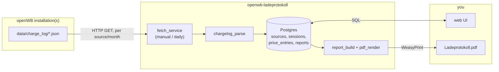

# openwb-ladeprotokoll

Turns openWB's charging history into an audit-safe PDF cost report — the
document a real accountant can use, not a screenshot of the Ladeprotokoll
table. Polls one or more openWB installations' `data/charge_log/*.json`
over plain HTTP (no core changes, no auth needed), stores it in Postgres,
lets you correct the cost per session against your own electricity
price/provider, and renders a selectable-column PDF that stays
reproducible even if the source data is edited later.

<br clear="left">

## Status

The full flow works end to end and has been exercised against a real,
running openWB installation and a real `docker compose up` deployment
(Proxmox LXC and a local dev box), not just unit tests and an embedded
test Postgres — see [DEVELOPMENT.md](DEVELOPMENT.md) for how both are
verified. Actively used and iterated on real feedback; see
[CHANGELOG.md](CHANGELOG.md) and [ROADMAP.md](ROADMAP.md) for what's
shipped and what's next.

## Features

- **Polls openWB's charge-log JSON over plain HTTP** —
  `data/charge_log/<yyyymm>.json`, served anonymously by openWB's own web
  server, no core changes or credentials needed. Manual "Jetzt abrufen",
  an on-demand backfill for older months, and a daily automatic fetch —
  configurable on/off and at any wall-clock time (default shortly after
  midnight) — all go through the same fetch/upsert code path.
- **Multiple openWB instances, multiple vehicles**, fleet scenario from
  day one — every source and vehicle is just a row, not a hardcoded
  single-install assumption.
- **Idempotent, refetch-safe storage** in Postgres: a still-charging
  session gets completed on the next fetch, and any correction openWB
  makes to a record in place is absorbed the same way — see
  [CLAUDE.md](CLAUDE.md) for the natural-key reasoning.
- **Electricity price correction**: enter your provider/price-per-kWh/
  validity period (optionally scoped to a source and/or vehicle), and the
  tool recomputes cost from kWh × price, compares it against openWB's own
  figure, and flags sessions where the two diverge — visible while
  reviewing which sessions to include in a report, though deliberately
  not carried onto the final PDF itself.
- **Per-vehicle Kennzeichen (license plate)**: openWB itself has no such
  field, so it's recorded here and documented on every generated report.
- **Audit-safe PDF reports**: review your sessions, toggle which of the 13
  Ladeprotokoll-mirroring columns appear, override the auto-matched price
  per session if needed, preview, then generate. Once generated, a report
  is immutable — the rendered PDF and a frozen snapshot of every included
  session and price used are stored, so it stays defensible even if the
  underlying openWB data or price entries are edited afterward.
- **Optional in-app self-update**, same pattern as the sibling
  [openwb-logger](https://github.com/seaspotter/openwb-logger) project —
  see [DEPLOYMENT.md](DEPLOYMENT.md).

## How it works



Full breakdown of each module in [CLAUDE.md](CLAUDE.md).

## Quick start

```bash
git clone https://github.com/seaspotter/openwb-ladeprotokoll.git
cd openwb-ladeprotokoll
cp .env.example .env
# edit .env: set a real POSTGRES_PASSWORD

docker compose up -d --build
```

Open http://localhost:8080, go to "Einstellungen" and add a source with
your openWB's address. Back on the overview, click "Jetzt abrufen" to
pull in its current month's charge log (need older months too? use
"Verlauf abrufen" in Einstellungen). Then "Bericht erstellen" to review
the fetched sessions and generate a PDF.

## Docs

- [MANUAL.md](MANUAL.md) — using the web UI: sources, fetching, price
  entries, generating a report
- [DEVELOPMENT.md](DEVELOPMENT.md) — local dev setup, running tests
- [DEPLOYMENT.md](DEPLOYMENT.md) — configuration reference, backups,
  upgrades, reverse proxy
- [ROADMAP.md](ROADMAP.md) — what's built, what's next
- [CHANGELOG.md](CHANGELOG.md) — notable changes by version
- [CLAUDE.md](CLAUDE.md) — architecture notes for whoever (human or
  Claude) touches this code next

## Known limitations

- No authentication on the web UI — see [DEPLOYMENT.md](DEPLOYMENT.md).
- The V2H/V2G discharge-energy field exists in the raw data but has only
  ever been observed as 0 (no sample vehicle uses V2H) — see the note in
  `app/chargelog_parse.py`.

## License

GNU Affero General Public License v3.0 or later (AGPL-3.0-or-later) — see
[LICENSE](LICENSE). Same choice as the sibling
[openwb-logger](https://github.com/seaspotter/openwb-logger) project, for
the same reason: this is a network service, and AGPL closes the "SaaS
loophole" plain GPL has — a modified version run as a hosted service has
to make its source available to that service's users too, not just to
whoever receives a copy of the software itself.
